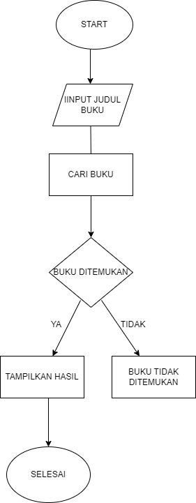

# studi kasus mencari buku di perpus

# stuudi kasus
sebuah program untuk mencari beberapa judul buku di perpustakaan. dimana kita harus memasukan judul buku tersebut
# proses coding 
1. input buku 
 kita diminta menginput judul buku yang tersedia di daftar buku
2. mengecek buku
memeriksa apakah buku ditemukan.jika YA ditemukan, kita ke langkah selanjutnya. jika TIDAK ditemukan kita gagal dalam mencari buku
3. menampilkan hasil
menampilkan hasil pencarian kepada pengguna
4. selesai 

